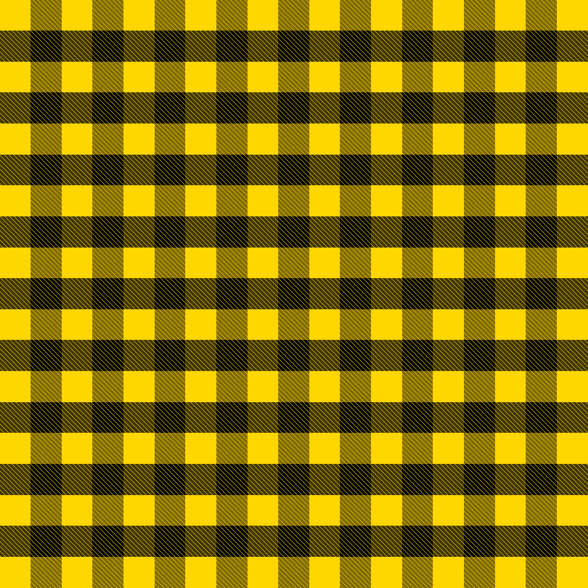
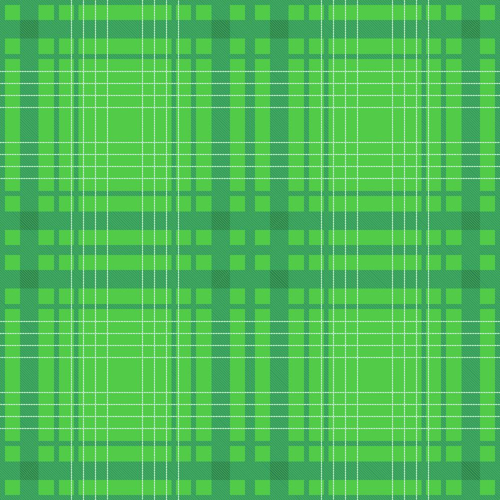
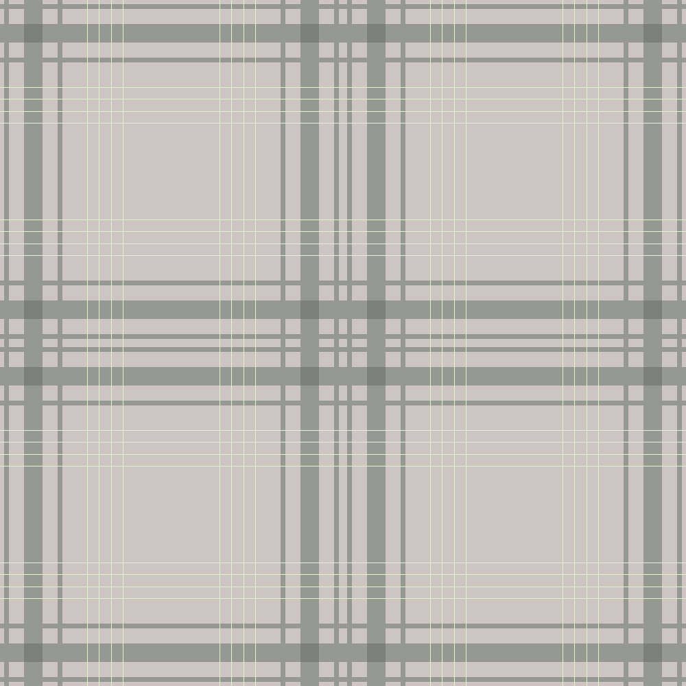
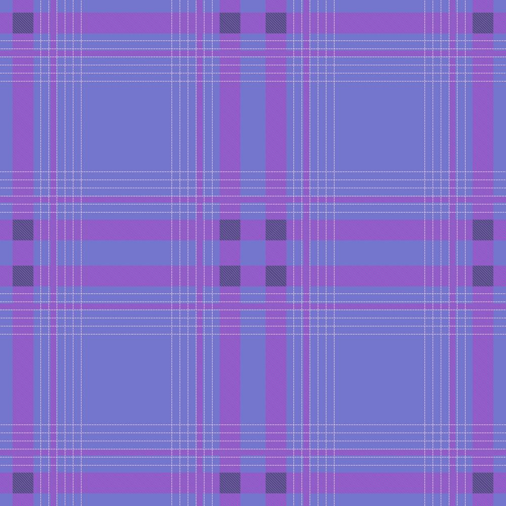
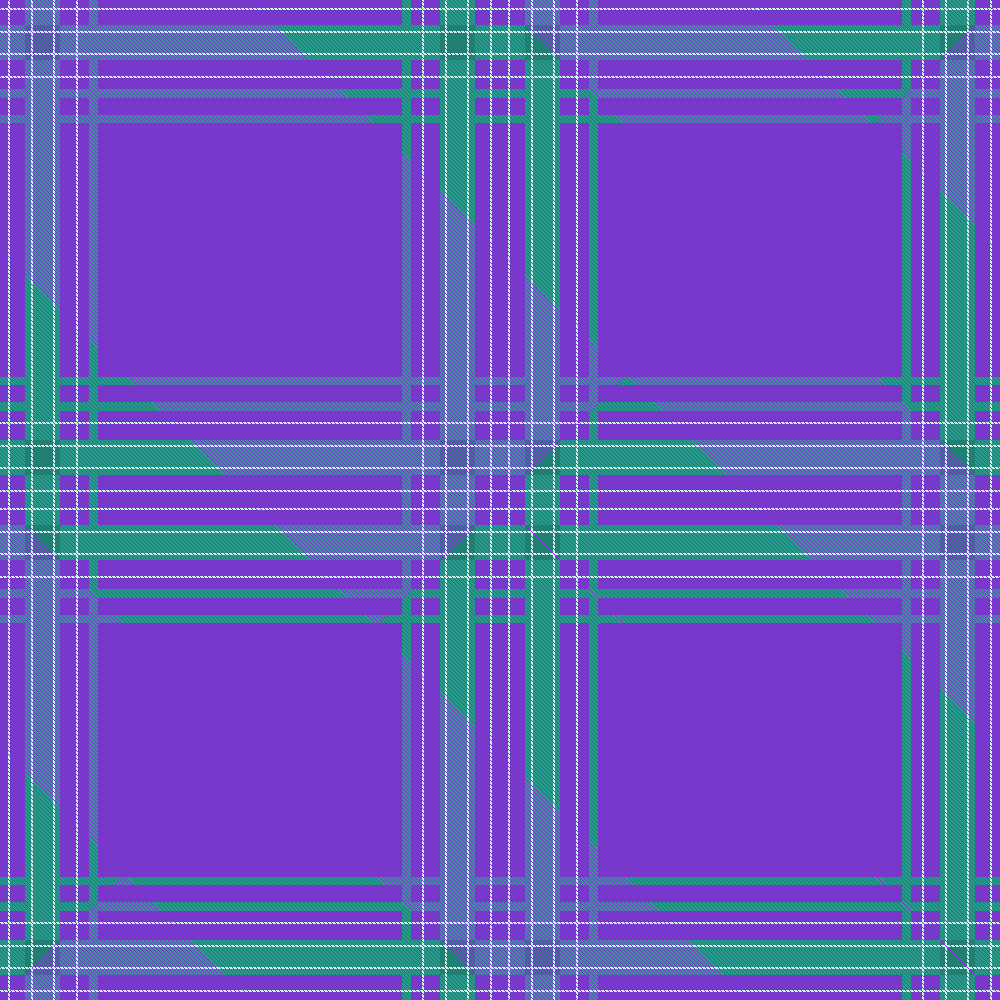
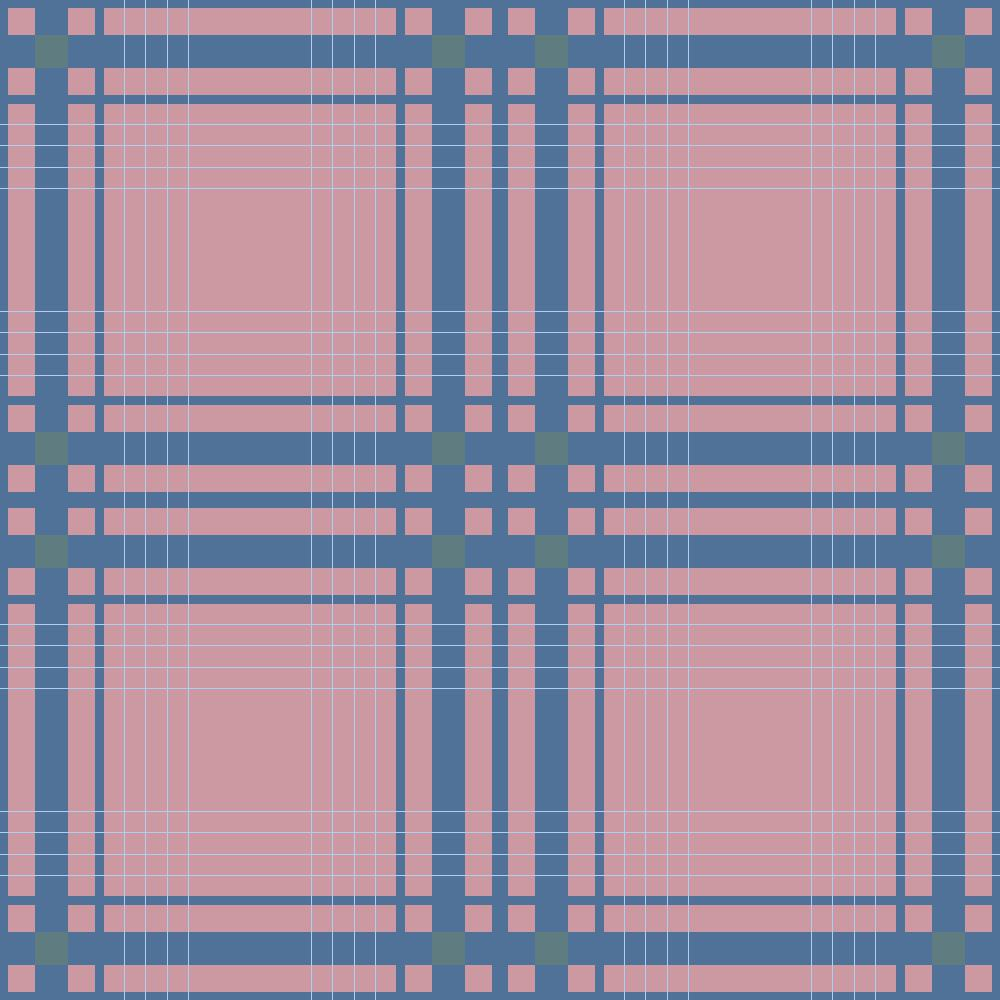

# Gone to Plaid
A plaid pattern generator
# Usage
`python gone_to_plaid.py -m <mode>`

mode options: 
- gingham
- buffalo
- plaid

Images will be saved in the same directory as gone_to_plaid.py

